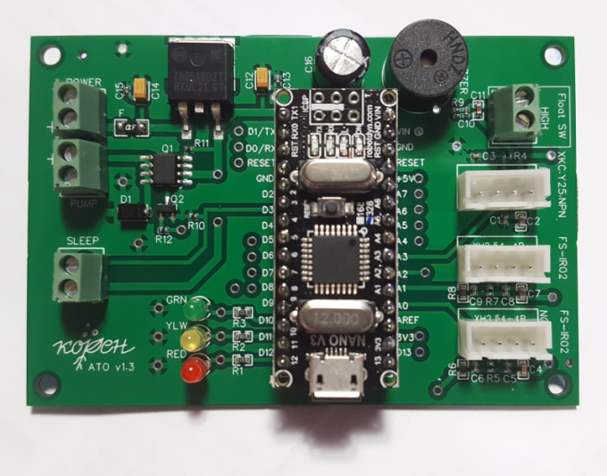
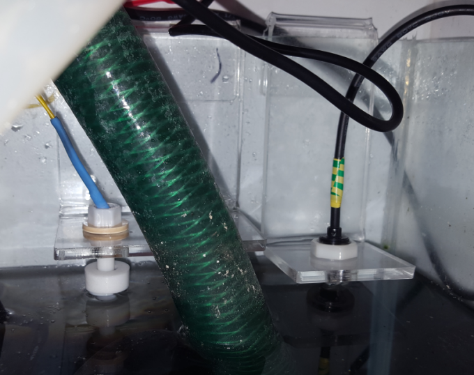

# AquariumATO

AquariumATO is an Arduino Nano-based **automatic top-off (ATO) controller** for maintaining aquarium or sump water level. It monitors liquid-level sensors, controls a top-off pump, and reports operating and fault states through LEDs and a buzzer.

The firmware is built around a small event-driven finite-state machine and includes independent safety mechanisms such as a high-water sensor, a finite pump runtime limit, an MCU watchdog, and optional low-water/reservoir monitoring.

> **Important:** AquariumATO is a supplementary automation aid, not a substitute for regular aquarium inspection. Plumbing, sensor placement, pump sizing, and siphon prevention remain the responsibility of the installer/operator.

## Features

- Automatic top-off using a mandatory **Normal** level sensor.
- Mandatory **High** level sensor for overfill protection.
- Optional **Low** aquarium-level sensor.
- Optional **Reservoir** low-level sensor.
- Manual dispense and sleep/wake control from one push button.
- Green, yellow, and red status LEDs.
- Audible alarm patterns for fault/warning states.
- Configurable sleep, idle, and maximum pump runtime values stored in EEPROM.
- Non-blocking serial configuration console (`GET`, `SET`, `SAVE`, `RESET`, `TRACE`).
- Pump runtime safety envelope of **5–180 seconds**; `0` cannot disable the cutoff through configuration.
- AVR watchdog protection.
- Unity test suites for the reusable utilities, FSM, sensors, button handling, and configuration subsystem.

## Documentation

Detailed documentation is split by audience:

- [User Guide](doc/UserGuide.md) — installation, operation, LED/buzzer meanings, button behavior, configuration, maintenance, and troubleshooting.
- [Hardware Guide](doc/HardwareGuide.md) — wiring, pin map, sensors, power architecture, pump driver, plumbing, maintenance, and hardware design notes.
- [Toolchain Bootstrap](doc/ToolchainBootstrap.md) — fresh-machine setup for PlatformIO, VS Code, and CLion/CMake.
- [Testing Guide](doc/TestingGuide.md) — Unity suites, target requirements, running tests, and test-development conventions.
- [Development Guide](doc/DevelopmentGuide.md) — firmware architecture, FSM, `Runnable`, configuration design, and extension conventions.

## Hardware Overview

The production firmware targets an **Arduino Nano / ATmega328P**.

### MCU pin map

| Function | Pin |
|---|---:|
| Red LED | D12 |
| Yellow LED | D11 |
| Green LED | D10 |
| Water pump control | D4 |
| Push button | D3 |
| Buzzer | D2 |
| Normal level sensor | A0 |
| Low level sensor *(optional)* | A1 |
| High level sensor | A2 |
| Reservoir level sensor *(optional)* | A3 |

The **Normal** and **High** sensors are mandatory. The Low and Reservoir sensors can be compiled in independently.

For electrical details, sensor types, PCB power architecture, pump wiring, and safe physical installation, see the [Hardware Guide](doc/HardwareGuide.md).

### Project hardware

[AutoTopOff 191023A hardware project on EasyEDA / OSHWLab](https://oshwlab.com/gorjan.dzundev/autotopoff-191023a)





## Operating Overview

A normal automatic cycle is:

1. The controller waits in **Idle** while the Normal sensor reports the desired water level.
2. When the water level falls below the Normal sensor, the controller enters automatic dispensing and starts the pump.
3. When the Normal sensor is reached again, the pump stops and the controller returns to Idle.
4. If a safety or fault condition occurs, the pump is stopped and the relevant warning/alarm state is entered.

The High sensor provides an independent level threshold above the Normal sensor. Optional Low and Reservoir sensors add further monitoring when enabled in the build.

### Compact status summary

| Status | Main indication | Meaning |
|---|---|---|
| Idle | Green slow blink | Normal standby operation |
| Automatic dispense | Green solid | Pump running automatically |
| Manual dispense | Green fast blink | Pump running from button command |
| Sleeping | Yellow slow blink | Automatic top-off temporarily suspended |
| Water low | Red fast blink + buzzer | Optional low-level threshold triggered |
| Water high | Red fast blink + buzzer | High-water safety threshold triggered |
| Reservoir empty | Red slow blink + buzzer | Reservoir warning or automatic pump timeout |
| Idle too long | Green + red slow blink + buzzer | No top-off cycle for the configured idle period |
| Error | Red fast blink + buzzer | Inconsistent or unexpected FSM event condition |

For the complete button behavior, alarm patterns, recovery actions, and troubleshooting steps, see the [User Guide](doc/UserGuide.md).

## Safety

Aquarium automation can fail mechanically, electrically, or in software. Use multiple independent safeguards where practical.

Key AquariumATO protections include:

- **High-water sensor:** stops normal dispensing and enters the high-water warning state.
- **Finite pump runtime:** every accepted `PUMP_MAX_ON_MS` value must be between **5000 ms and 180000 ms**, inclusive.
- **Watchdog:** the ATmega328P watchdog resets the controller if the main loop stops servicing it.
- **Optional reservoir sensor:** can stop dispensing when the top-off reservoir becomes empty.
- **Optional low-level sensor:** can detect an unexpectedly low aquarium/sump level.

### Prevent siphoning

Pump shutdown cannot stop a gravity siphon. Route the tubing and position the reservoir/outlet so water cannot continue flowing after the pump switches off. See the [Hardware Guide](doc/HardwareGuide.md) for installation guidance.

## Build and Upload

The production PlatformIO environment is:

```text
nanoatmega328
```

Do **not** substitute `nanoatmega328new`; the configured production target uses the classic Nano bootloader profile.

### Build

```bash
pio run -e nanoatmega328
```

### Upload

```bash
pio run -e nanoatmega328 -t upload
```

The Nano upload path uses the bootloader upload rate associated with this board profile (57600 baud). The AquariumATO runtime serial console is a separate interface and runs at **9600 baud**.

### Serial monitor

```bash
pio device monitor -b 9600
```

For complete environment setup, USB permissions, VS Code, and CLion/CMake configuration, see [Toolchain Bootstrap](doc/ToolchainBootstrap.md).

## Optional Sensors

The Low and Reservoir sensors are controlled with PlatformIO build flags in `platformio.ini`:

```ini
build_flags =
    -D ATO_HAS_LOW_SENSOR
    -D ATO_HAS_RESERVOIR_SENSOR
```

Enable either flag independently as required by the installed hardware.

The Normal and High sensors are always compiled in and are required by the production design.

## Runtime Configuration

The firmware provides a non-blocking serial console at **9600 baud**. Commands are case-insensitive and processed one line at a time.

Available commands:

```text
HELP
GET
SET <NAME> <VALUE>
SAVE
RESET
TRACE ON
TRACE ALL
TRACE OFF
```

Runtime-configurable fields are:

```text
SLEEP_MAX_MS
IDLE_MAX_MS
PUMP_MAX_ON_MS
```

Example:

```text
GET
SET PUMP_MAX_ON_MS 60000
SAVE
```

`SET` applies a valid value immediately but does **not** persist it. `SAVE` writes the current configuration to EEPROM. `RESET` restores the compiled defaults in memory but does not persist them until `SAVE` is issued.

`PUMP_MAX_ON_MS` is safety validated and accepts only **5000..180000 ms** inclusive. Invalid configuration is rejected rather than clamped or silently applied.

`TRACE ON` logs FSM transitions. `TRACE ALL` also logs dispatched events that match no transition rule. Tracing is intended for diagnostics and is not persisted.

See the [User Guide](doc/UserGuide.md) for operator-oriented examples and the [Development Guide](doc/DevelopmentGuide.md) for configuration internals.

## Compiled Defaults

The current production defaults are:

| Setting | Default |
|---|---:|
| Maximum sleep time | 2 hours |
| Maximum idle time | 6 hours |
| Maximum single pump run | 90 seconds |
| Button debounce | 160 ms |
| Long press | 3 seconds |

The three runtime timing values are loaded from EEPROM when a valid saved configuration exists; otherwise the firmware falls back to the compiled defaults.

## Testing

The repository contains Unity test suites for:

- `RingBuffer`
- `Runnable`
- `Timer`
- `TimedSwitchable`
- `CyclicSwitchable`
- `LiquidLevelSensor`
- `PushButton`
- `AtoFsm`
- ATO configuration store and serial-console behavior

Most tests can run on the Nano target. The FSM suite uses the Mega 2560 test target because the Unity test image needs more SRAM than the production Nano provides.

> **Warning:** configuration-store tests exercise real EEPROM and are destructive to the saved configuration on the test board.

See [Testing Guide](doc/TestingGuide.md) before running or extending the suites.

## Repository Layout

```text
AquariumATO-master/
├── include/ato/      # ATO FSM, actions, configuration and serial console
├── lib/              # Reusable embedded utility classes
├── src/main.cpp      # Production composition, pins and callbacks
├── test/             # Unity test suites
├── doc/              # User, hardware, toolchain, testing and development guides
├── platformio.ini    # Production and test PlatformIO environments
└── CMakeLists.txt    # CLion/CMake integration
```

## Contributing / Development

Before changing firmware behavior:

1. Read the [Development Guide](doc/DevelopmentGuide.md).
2. Build the production `nanoatmega328` environment.
3. Run the relevant Unity suites described in the [Testing Guide](doc/TestingGuide.md).
4. Preserve the pump safety invariant: configured pump runtime must always remain finite and within the defined safety envelope.
5. Update the appropriate user/developer documentation when behavior or hardware assumptions change.

## Disclaimer

AquariumATO is a DIY aquarium automation project and is used at your own risk. No automated top-off system should be considered completely fail-safe. Verify component ratings, wiring, sensor placement, pump behavior, plumbing, siphon prevention, enclosure protection, and electrical safety for your installation, and continue to inspect the aquarium and ATO hardware regularly.

The project authors and contributors are not responsible for aquarium damage, livestock loss, water damage, electrical damage, equipment failure, or other losses resulting from the construction, modification, installation, configuration, or operation of the device, or from the use or modification of the firmware or schematics.
