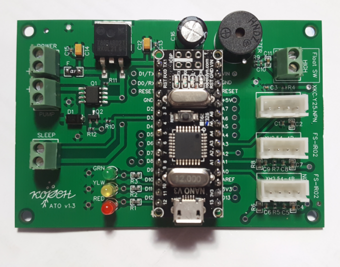
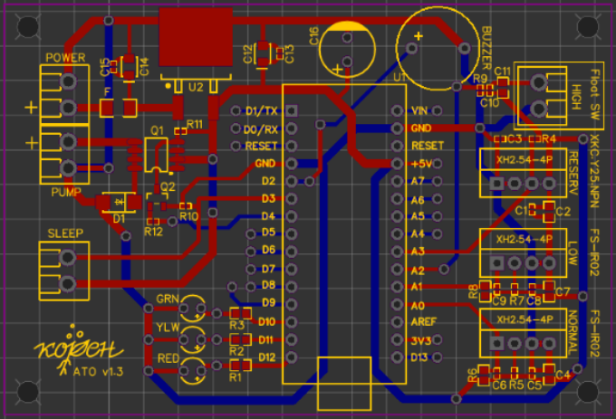

# Auto Top Off (ATO) Controller

This project is an **Auto Top Off (ATO) controller** designed to maintain optimal water levels in an aquarium. The program leverages Arduino-compatible hardware to monitor liquid levels and control devices like LEDs, a water pump, a buzzer, and user interface components.

## Features

- **Liquid Level Monitoring**: Uses liquid level sensors to detect normal, low and high water levels.
- **LED Status Indicators**: Red, yellow, and green LEDs to signal the system's status.
- **Buzzer Alerts**: Audible feedback for critical events.
- **Water Pump Control**: Automatically dispenses water to maintain desired levels.
- **Push Button Functionality**:
  - Short press: Dispense water, or exit sleep mode.
  - Long press: Enter sleep mode, or exit sleep mode.
- **Timed Operation**: Includes configurable sleep and idle timers.
- **Safety Mechanisms**:
  - Watchdog timer to prevent system hangs.
  - Maximum water pump run time to avoid overfilling and pump damage.
  - Maximum sleep time to revert back to normal operation.
  - Maximum idle time to notify possible sensor impediments.

## Hardware Requirements

- Arduino-compatible micro-controller.
- Liquid level sensors (Normal, Low, High, and Reservoir).
- LEDs (Red, Yellow, Green).
- Buzzer.
- Water pump.
- Push button.
- External power supply (9-12V, 500mA or more).

## Pin Configuration

Pin values can be edited in the [`main.cpp`](/src/main.cpp) file

| Component                | Pin     |
|--------------------------|---------|
| Red LED                  | 12      |
| Yellow LED               | 11      |
| Green LED                | 10      |
| Water Pump               | 4       |
| Push Button              | 3       |
| Buzzer                   | 2       |
| Normal Liquid Level Sensor | A0     |
| Low Liquid Level Sensor | A1     |
| High Liquid Level Sensor | A2      |
| Reservoir Liquid Level Sensor | A3      |

* The Normal and High Liquid Level Sensors are mandatory. 
* The Low and Reservoir Liquid Level Sensors are optional. 

## Software Components

The program includes and uses the following libraries and modules:
- `CyclicSwitchable` and `TimedSwitchable`: For LED and pump control.
- `LiquidLevelSensor`: For reading and processing liquid levels.
- `PushButton`: For handling button presses.
- `Timer`: For managing sleep and idle operations.
- `AtoFsm` and `AtoActions`: Finite State Machine (FSM) to coordinate system behavior.
- `Runnable`: For code separation into reusable and maintainable chunks.  

## Setup Instructions

### Hardware Development

[AutoTopOff 191023A at EasyEDA](https://oshwlab.com/gorjan.dzundev/autotopoff-191023a)




### PCB



### Schematics


1. **Hardware Assembly**:
   - Connect components to the specified pins on the micro-controller.
   - Ensure proper power supply connections.

2. **Software Configuration**:
   - Clone this repository to your development environment.
   - Install required libraries.

3. **Customization**:
   Modify these parameters in the code as needed:
   - **LED polarity**: `WHEN_ON__PIN_HIGH` or `WHEN_ON__PIN_LOW`.
   - **Push button debounce duration**: `PUSH_BUTTON_DEBOUNCE_MS`.
   - **Push button long press duration**: `PUSH_BUTTON_LONG_PRESS_DURATION`.
   - **Timers**:
     - Sleep timer duration: `sleepTimer.setDurationMs()`.
     - Idle timer duration: `idleTimer.setDurationMs()`.
   - **Water pump max runtime**: `waterPump.setMaxOnTimeMs()`.

4. **Upload**:
   - Compile and upload the code to your micro-controller using the Arduino IDE or a compatible tool.

## Usage

1. The system initializes in an idle state, with LEDs signaling the status.
2. When the normal liquid level sensor detects a drop, the water pump activates to top off the reservoir.
3. The high liquid level sensor prevents overfilling by deactivating the pump.
4. Press the push button for:
   - **Short press**: Manually activate the pump, stop the pump, or exit sleep mode.
   - **Long press**: Put the system into sleep mode, or exit sleep mode.

## Safety and Maintenance

- **Watchdog Timer**: Automatically resets the system if it becomes unresponsive.
- **Prevent Overfilling**: The high-level sensor acts as an overfill failsafe.
- **Low Level Sensor**: If present, triggers an alarm if the water level is low.
- **Reservoir Sensor**: If present, triggers an alarm if the reservoir water level is low.
- **Sleep Timer**: Automatically takes the device out of sleep mode after preset time.
- **Idle Timer**: Triggers an alarm if the device is in Idle state for too long.
- **Regular Checks**: Ensure sensors and the pump are functioning correctly.

## AtoActions State Descriptions

### **1. `onExitState`**
- **Description:** Actions performed when exiting any state.
- **Actions:**
  - Turns off all LEDs (**red**, **yellow**, and **green**).
  - Turns off the **buzzer**.
  - Turns off the **water dispenser**.
  - Stops the **sleep timer** and **idle timer**.
- **Blink/Buzz Patterns:** None.

---

### **2. `onEntryIdleState`**
- **Description:** Actions performed when the system is in an idle state.
- **Actions:**
  - The **green LED** blinks slowly.
  - Activates the **idle timer**.
- **Blink Pattern:**
  - **Green LED:** Blinks slowly (`1520ms ON, 380ms OFF`).
- **Buzz Pattern:** None.

---

### **3. `onEntryIdleForTooLongState`**
- **Description:** Actions performed when the system has been idle for too long.
- **Actions:**
  - The **green LED** blinks slowly.
  - The **red LED** blinks slowly.
  - The **buzzer** plays a pattern to signal prolonged idle time.
- **Blink Pattern:**
  - **Green LED:** Blinks slowly (`1520ms ON, 380ms OFF`).
  - **Red LED:** Blinks slowly (`1520ms ON, 380ms OFF`).
- **Buzz Pattern:** 
  - **Idle Too Long Buzzer Pattern:**
    - 5 short buzzes (`400ms ON, 1400ms OFF`), followed by a long buzz (`1800ms ON`).
    - Repeats after **30 seconds**.
    - Idle silence lasts until **10 minutes** elapse from the pattern's start.
    - Repeat.

---

### **4. `onEntryDispensingInAutoModeState`**
- **Description:** Actions performed when water is dispensed automatically.
- **Actions:**
  - The **green LED** stays constantly on.
  - Activates the **water dispenser**.
- **Blink Pattern:**
  - **Green LED:** Constantly ON.
- **Buzz Pattern:** None.

---

### **5. `onEntryDispensingInManualModeState`**
- **Description:** Actions performed when water is dispensed manually.
- **Actions:**
  - The **green LED** blinks rapidly.
  - Activates the **water dispenser**.
- **Blink Pattern:**
  - **Green LED:** Blinks rapidly (`380ms ON, 380ms OFF`).
- **Buzz Pattern:** None.

---

### **6. `onEntryWaterLowState`**
- **Description:** Actions performed when the water level is low.
- **Actions:**
  - The **red LED** blinks rapidly.
  - The **buzzer** plays a pattern to alert about low water level.
- **Blink Pattern:**
  - **Red LED:** Blinks rapidly (`380ms ON, 380ms OFF`).
- **Buzz Pattern:**
  - **Low Water Buzzer Pattern:**
    - Long buzz (`1400ms ON`), followed by 2 short buzzes (`700ms ON, 400ms OFF`).
    - Repeats after **30 seconds**.
    - Idle silence lasts until **10 minutes** elapse from the pattern's start.
    - Repeat.

---

### **7. `onEntryWaterHighState`**
- **Description:** Actions performed when the water level is too high.
- **Actions:**
  - The **red LED** blinks rapidly.
  - The **buzzer** plays a pattern to alert about high water level.
- **Blink Pattern:**
  - **Red LED:** Blinks rapidly (`380ms ON, 380ms OFF`).
- **Buzz Pattern:**
  - **High Water Buzzer Pattern:**
    - 5 long buzzes (`1400ms ON, 400ms OFF`).
    - Repeats after **30 seconds**.
    - Idle silence lasts until **10 minutes** elapse from the pattern's start.
    - Repeat.

---

### **8. `onEntryReservoirEmptyState`**
- **Description:** Actions performed when the reservoir is empty.
- **Actions:**
  - The **red LED** blinks slowly.
  - The **buzzer** plays a pattern to indicate the empty reservoir.
- **Blink Pattern:**
  - **Red LED:** Blinks slowly (`1520ms ON, 380ms OFF`).
- **Buzz Pattern:**
  - **Reservoir Empty Buzzer Pattern:**
    - 3 long buzzes (`1400ms ON, 400ms OFF`).
    - Repeats after **30 seconds**.
    - Idle silence lasts until **10 minutes** elapse from the pattern's start.
    - Repeat.

---

### **9. `onEntrySleepingState`**
- **Description:** Actions performed when the system enters a sleep state.
- **Actions:**
  - The **yellow LED** blinks slowly.
  - Activates the **sleep timer**.
- **Blink Pattern:**
  - **Yellow LED:** Blinks slowly (`1520ms ON, 380ms OFF`).
- **Buzz Pattern:** None.

---

### **10. `onEntryErrorState`**
- **Description:** Actions performed when an error occurs.
- **Actions:**
  - The **red LED** blinks rapidly.
  - The **buzzer** plays a pattern to indicate an error.
- **Blink Pattern:**
  - **Red LED:** Blinks rapidly (`380ms ON, 380ms OFF`).
- **Buzz Pattern:**
  - **Error Buzzer Pattern:**
    - 2 short buzzes (`700ms ON, 400ms OFF`), followed by a long buzz (`1400ms ON`).
    - Repeats after **30 seconds**.
    - Idle silence lasts until **10 minutes** elapse from the pattern's start.
    - Repeat.

## Acknowledgments

- [paulmurraycbr.github.io](https://paulmurraycbr.github.io/ArduinoTheOOWay.html)
- [Nick Gammon](https://www.gammon.com.au/scripts/forum.php)

---

# Development Guide - Ubuntu

## C/C++ Installation

<https://medium.com/@ppatil/avr-programing-using-avrdude-in-ubuntu-93734c26ad19>

## VS Code

### Install VS Code (Ubuntu)

* Open the `App Center`
* Search for `code`
* Install

### Install VS Code Plugins

<https://marketplace.visualstudio.com/items?itemName=ms-vscode.cpptools>
<https://marketplace.visualstudio.com/items?itemName=ms-vscode.cpptools-themes>
<https://marketplace.visualstudio.com/items?itemName=geeebe.duplicate>
<https://marketplace.visualstudio.com/items?itemName=chadalen.vscode-jetbrains-icon-theme>
<https://marketplace.visualstudio.com/items?itemName=DavidAnson.vscode-markdownlint>
<https://marketplace.visualstudio.com/items?itemName=redhat.vscode-yaml>
<https://marketplace.visualstudio.com/items?itemName=platformio.platformio-ide>

### Install PlatformIO Rules

<https://docs.platformio.org/en/latest/core/installation/udev-rules.html> 

## CLion Installation (Incomplete)

<https://blog.jetbrains.com/clion/2020/08/arduino-from-hobby-to-prof-p1/>

### Install PlatformIO (Ubuntu)

```shell
sudo apt-get update
sudo apt-get install gcc build-essential
sudo apt-get install gcc-avr binutils-avr avr-libc gdb-avr
sudo apt-get install avrdude
sudo apt-get install libusb-dev

sudo apt  install curl

mkdir -p /home/$USER/Downloads
cd /home/$USER/Downloads

curl -fsSL -o get-platformio.py https://raw.githubusercontent.com/platformio/platformio-core-installer/master/get-platformio.py

python3 get-platformio.py

echo -e 'export PATH=$PATH:$HOME/.local/bin\n' >> /home/$USER/.profile

mkdir -p ~/.local/bin/

ln -s ~/.platformio/penv/bin/platformio ~/.local/bin/platformio
ln -s ~/.platformio/penv/bin/pio ~/.local/bin/pio
ln -s ~/.platformio/penv/bin/piodebuggdb ~/.local/bin/piodebuggdb
```

### Install PlatformIO plugin for CLion

1. Open CLion
2. `Ctrl + Alt + S` > Plugins
3. Marketplace > Search `PlatformIO`
4. Install > Restart IDE

### Setup CLion

1. `Ctrl + Alt + S`  > `Build, Execution, Deployment`
2. `Toolchains` > `+` > `System`
    * Name: `Arduino`
    * C Compiler: `/home/<user>/.platformio/packages/toolchain-atmelavr/bin/avr-gcc`
    * C++ Compiler: `/home/<user>/.platformio/packages/toolchain-atmelavr/bin/avr-g++`
3. `CMake` > `+`
    * Name: `Nano`
    * Build Type: `nano`
    * Toolchain: `Arduino`
