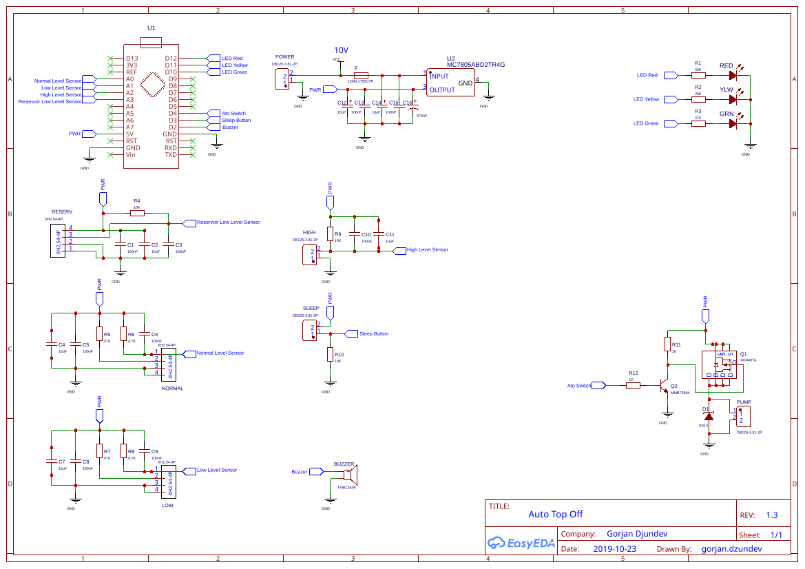

# AquariumATO Hardware Guide

This guide documents the physical AquariumATO controller: PCB power architecture, I/O assignments, sensors, pump driver, wiring expectations, and installation constraints.

It is intended for anyone building, repairing, wiring, or troubleshooting the hardware. Firmware architecture and development workflow belong in `DevelopmentGuide.md`; end-user operation belongs in `UserGuide.md`.

## 1. Hardware baseline

The current production firmware targets an Arduino Nano-compatible ATmega328P board (`nanoatmega328`). The PCB and schematic are Auto Top Off revision 1.3, dated 2019-10-23.

The controller provides:

- three status LEDs: red, yellow, and green;
- one active buzzer;
- one push button;
- one pump output;
- mandatory Normal and High liquid-level inputs;
- optional Low and Reservoir liquid-level inputs;
- a watchdog-backed firmware safety layer and a hardware-switched pump output.

The repository contains board photographs and a rendered schematic under `doc/images/`. The original hardware project is also linked from the root `README.md` through EasyEDA/OSHWHub.

## 2. MCU pin map

The firmware pin assignments are defined in `src/main.cpp`.

| Function | MCU pin | Required | Notes |
|---|---:|---|---|
| Red LED | D12 | Yes | Active HIGH in the current firmware |
| Yellow LED | D11 | Yes | Active HIGH |
| Green LED | D10 | Yes | Active HIGH |
| Water pump control | D4 | Yes | Drives the external pump switching stage, not the pump directly |
| Push button | D3 | Yes | Current production configuration uses `INPUT`, released state LOW |
| Buzzer | D2 | Yes | Active HIGH |
| Normal level sensor | A0 | Yes | Primary top-off control sensor |
| Low level sensor | A1 | Optional | Compiled only with `ATO_HAS_LOW_SENSOR` |
| High level sensor | A2 | Yes | Independent high-water failsafe input |
| Reservoir low-level sensor | A3 | Optional | Compiled only with `ATO_HAS_RESERVOIR_SENSOR` |

Do not change wiring based only on this table and then assume the firmware will adapt automatically. If a PCB signal is moved to another MCU pin, the corresponding constant in `src/main.cpp` must also be changed and the firmware rebuilt.



## 3. Power architecture

### 3.1 Input supply

Use a suitable regulated **9-12 V DC supply rated for at least 500 mA** for the intended hardware configuration.
The schematic labels the raw input rail as **10 V**.

The input enters through the two-position `POWER` terminal block and passes through the board protection/filtering stage before the linear regulator.
If the pump or other hardware is changed, verify the resulting voltage and current requirements before use.

### 3.2 `VCC` and `PWR` are not the same rail

The schematic uses two names that can be easy to misread:

- **`VCC`** is the raw external input rail before the 5 V regulator; the schematic annotates it as 10 V.
- **`PWR`** is the regulated output rail after the MC7805 regulator and is the rail used by the Nano, sensors, and pump switching stage.

In other words, on this board `PWR` is the regulated logic/pump rail, while `VCC` is the higher-voltage supply entering the regulator.

Do not connect a sensor or other 5 V-only device to the raw `VCC` rail.

### 3.3 Regulator and filtering

The schematic shows an MC7805-series linear regulator (`U2`) with bulk and 100 nF decoupling capacitors around the supply rails. The board therefore dissipates the difference between the external input voltage and 5 V as heat.

When selecting the external supply and pump, account for:

- pump current;
- Nano and sensor current;
- regulator dissipation;
- ambient temperature and enclosure ventilation.

A higher input voltage increases regulator dissipation. If the hardware is modified to use a significantly higher-current pump or additional loads, re-evaluate the regulator and PCB thermal/current limits rather than assuming the existing design is adequate.

## 4. Sensor arrangement

The hardware intentionally uses different sensing technologies for different roles.

### 4.1 Normal level sensor - FS-IR02 optical sensor

The Normal sensor is connected to A0 and is mandatory.

The PCB uses a four-pin connector marked for an **FS-IR02** sensor. The board includes local RC filtering and bias components around the sensor input.

This sensor defines the normal operating water level. When the sensed level falls away from the Normal sensor, the firmware can start automatic top-off. When normal level is restored, dispensing stops.

Install the sensor at the water height the system should normally maintain.

### 4.2 Low level sensor - FS-IR02 optical sensor

The Low sensor is connected to A1 and is optional.

It uses the same four-wire FS-IR02-style interface and board filtering as the Normal sensor. Its purpose is to detect an abnormally low aquarium/sump level and raise a warning condition.

The firmware only includes this sensor when built with:

```ini
-D ATO_HAS_LOW_SENSOR
```

If the hardware is not fitted with this sensor, leave the build flag disabled rather than attempting to simulate the input with arbitrary wiring.

### 4.3 High level sensor - float switch

The High sensor is connected to A2 and is mandatory.

The PCB connector is explicitly marked **`Float SW`** / `HIGH` and is a two-wire switch input. The schematic includes pull/bias and RC filtering components around this input.

This sensor is intentionally independent of the primary Normal sensor and acts as a high-water failsafe. It should be mounted above the normal operating level, at a height where reaching it is abnormal but still safe.

The physical orientation of a float switch determines whether it is open or closed at a given water level. Verify the installed orientation against the board/firmware behavior before relying on it as an overfill failsafe.

Use the float switch in a **normally open (NO) configuration**: below the high-level threshold the switch should be open, and when rising water lifts the float it should close, causing the HIGH sensor input to read `HIGH` and trigger the high-water failsafe.

### 4.4 Reservoir low-level sensor - XKC-Y25-NPN non-contact sensor

The Reservoir sensor is connected to A3 and is optional.

The PCB identifies this four-wire input for an **XKC-Y25-NPN** non-contact liquid-level sensor. Unlike an immersed float or optical tip, this type of sensor is intended to detect liquid through the wall of a suitable non-metallic reservoir.

The firmware only includes the reservoir input when built with:

```ini
-D ATO_HAS_RESERVOIR_SENSOR
```

Mount the sensor at the minimum usable reservoir level, taking into account the pump pickup height and the amount of water needed to keep the pump supplied.

💡 **Tip**: You can secure the sensor with **neutral-cure silicone adhesive**, **aquarium-safe silicone**, a **removable clamp/bracket**, or **double-sided mounting tape** if the mounting surface stays dry. Avoid adhesives that can release solvents or contaminants near aquarium water.

### 4.5 Sensor filtering and debounce

The PCB provides analog RC filtering around the sensor inputs, and the firmware adds a second filtering layer using sampled readings in `LiquidLevelSensor`.

Treat both layers as part of the design. Removing the hardware capacitors/resistors or changing them substantially may alter response time and noise immunity even if the firmware is unchanged.

## 5. Optional-sensor build configurations

Normal and High sensors are always compiled into the production firmware.

Low and Reservoir sensors are independently optional. In `platformio.ini`, enable either feature by adding the corresponding build definition to the `nanoatmega328` environment:

```ini
build_flags =
    -D ATO_HAS_LOW_SENSOR
    -D ATO_HAS_RESERVOIR_SENSOR
```

Use only the definitions that match the actually installed hardware.

| Hardware fitted | `ATO_HAS_LOW_SENSOR` | `ATO_HAS_RESERVOIR_SENSOR` |
|---|---|---|
| Normal + High only | Off | Off |
| Normal + High + Low | On | Off |
| Normal + High + Reservoir | Off | On |
| All four sensors | On | On |

A fitted optional sensor that is not compiled in will be ignored by the firmware. Conversely, compiling in a sensor that is not electrically present can create misleading state changes from a floating or biased input.

## 6. Push button

The push button is connected to D3 through the board's `SLEEP` connector/input network.

The current production constants are:

```cpp
PUSH_BUTTON_PIN_INPUT_MODE = INPUT
PUSH_BUTTON_PIN_STATE_WHEN_RELEASED = LOW
```

The board schematic includes a 10 kOhm bias resistor and filtering around the button input. The `PushButton` class also performs software debounce.

If adapting the hardware to use `INPUT_PULLUP`, change both the electrical wiring and the firmware's released-state configuration consistently.

## 7. LEDs and buzzer

### 7.1 LEDs

The board contains red, yellow, and green status LEDs with individual series resistors. The firmware drives all three as active-HIGH outputs.

The meaning and timing of LED patterns are user-interface behavior and should be documented in `UserGuide.md`, not duplicated here.

### 7.2 Buzzer

The schematic shows a TMB12A05 buzzer driven from D2. The firmware treats the buzzer as an active-HIGH switchable output and generates audible patterns in software.

If replacing the buzzer, verify voltage, current, and active/passive type. A passive transducer that expects an AC/audio waveform **is not equivalent** to the active buzzer shown in this design.

## 8. Pump output stage

The pump is not driven directly from Arduino D4.

The schematic shows a discrete switching chain:

1. D4 (`Ato Switch`) drives Q2 through R12.
2. Q2 controls the gate-drive node for Q1.
3. Q1 is the power switching device in the pump path.
4. D1 (`SS14`) provides inductive transient/flyback suppression around the pump load.
5. The pump connects through the two-position `PUMP` terminal block.

This arrangement keeps motor current out of the MCU pin and provides a switching stage appropriate for the inductive load.

### 8.1 Pump electrical constraints

Before substituting another pump, verify at minimum:

- rated voltage against the board's regulated `PWR` rail;
- startup/stall current;
- continuous current relative to Q1, PCB traces, connectors, regulator, and supply;
- flyback/transient requirements;
- suitability for the intended fresh/RO/DI top-off water.

Do not infer that any pump physically fitting the connector is electrically safe.

### 8.2 Firmware runtime cutoff

The production firmware defaults to a 90-second maximum continuous pump run. Runtime configuration enforces a safety envelope of 5 seconds through 180 seconds inclusive.

That timeout is an additional protection layer; it does not replace correct sensor installation, pump sizing, plumbing, or routine inspection.

## 9. Plumbing and physical installation

### 9.1 Sensor heights

A sensible vertical ordering in the sump/aquarium is:

1. High failsafe sensor - highest;
2. Normal control sensor - target operating level;
3. Low warning sensor - below normal, if fitted.

The exact spacing depends on sump geometry, pump flow, turbulence, and acceptable water-volume variation.

Avoid placing level sensors where bubbles, splashing, return-pump turbulence, or moving equipment can repeatedly wet/unwet them without a real water-level change.

### 9.2 Reservoir sensor placement

Place the optional reservoir sensor high enough above the pump's actual dry-run point that the system can react before the pump loses reliable water supply.

For a non-contact reservoir sensor, verify that:

- the reservoir wall material is compatible;
- wall thickness is within the sensor's usable range;
- the sensor is firmly coupled to the wall;
- condensation or nearby objects do not cause false triggering.

### 9.3 Siphon prevention - critical

**The top-off plumbing must be arranged so that a stopped pump cannot continue transferring water by siphon.**

The safest installation is to keep the top-off reservoir water level below the discharge/outlet point into the aquarium or sump and to ensure the outlet cannot become a submerged siphon path.

**A firmware command to turn the pump off cannot stop a gravity siphon**. The pump timeout, High sensor, watchdog, and FSM therefore do not protect against incorrectly routed plumbing that continues flowing with the pump electrically off.

After installation, deliberately test this condition:

1. run the pump until water is flowing normally;
2. switch the pump off;
3. confirm flow stops promptly and completely;
4. repeat with the reservoir at its highest expected fill level and the aquarium/sump at representative levels.

Do not put the system into unattended service until this test passes.

## 10. Assembly and wiring checks

Before first power-up:

- verify supply polarity at `POWER`;
- verify there is no short between `VCC`/raw input, `PWR`/regulated rail, and ground;
- confirm the Nano orientation;
- confirm pump polarity if the selected pump is polarity-sensitive;
- confirm every sensor is connected to its intended connector;
- verify optional-sensor firmware flags match fitted hardware;
- inspect the pump driver and SS14 diode orientation;
- inspect regulator and electrolytic capacitor polarity;
- check for solder bridges around the Nano headers and fine-pitch transistor pads;
- keep wet plumbing physically separated from exposed electronics.

For a new build, it is prudent to power the controller without the pump connected first and verify the regulated rail before attaching the motor load.

## 11. Bring-up procedure

A practical hardware bring-up sequence is:

1. **Unpowered continuity check** - inspect supply and ground for shorts.
2. **Power-rail check** - power the board without the pump and verify the regulated rail is approximately 5 V.
3. **MCU check** - confirm the Nano boots and can be programmed/monitored.
4. **LED/buzzer check** - exercise outputs through normal firmware behavior or a controlled test build.
5. **Button check** - confirm released and pressed states are stable.
6. **Sensor check** - test each fitted sensor independently before enabling the pump.
7. **Pump-driver check** - connect the pump only after the control output behaves correctly.
8. **Wet test** - test automatic stop at Normal level and independent stop/alarm behavior at High level.
9. **Reservoir-empty test** - if fitted, verify the reservoir sensor at the intended minimum level.
10. **Siphon test** - confirm all water movement stops when the pump switches off.

Use a controlled quantity of water and remain present during initial wet testing.

## 12. Hardware troubleshooting

### Controller does not power up

Check, in order:

- external supply voltage and polarity;
- connector and fuse/protection path;
- raw `VCC` rail;
- regulator input and output;
- regulated `PWR` rail;
- Nano seating/orientation.

Disconnect the pump while diagnosing a supply fault.

### Pump never runs

Check:

- pump voltage/current compatibility;
- pump wiring and terminal polarity;
- D4 activity;
- Q2/Q1 switching stage;
- whether the firmware is in a state that permits dispensing;
- High or optional Reservoir sensor state;
- configured pump runtime.

### Pump runs electrically but no water arrives

Check the hydraulic side before changing firmware:

- reservoir level;
- blocked/kinked tubing;
- air lock;
- pump priming;
- excessive lift/head;
- inlet obstruction;
- failed or worn pump.

### Sensor state is unstable

Check:

- connector seating and ground continuity;
- supply rail stability;
- sensor mounting and correct technology for that location;
- bubbles/turbulence/splashing;
- hardware RC components around the input;
- cable routing near the pump/motor wiring.

💡 **Tip**: You can do a quick check of the IR (infrared) sensor with a phone camera. While the sensor is powered, look at the IR emitter through the camera; on many phones it appears as a faint violet/purple glow, even though the infrared light is not visible to the naked eye.

💡 **Tip**: If the IR sensor is exposed to external light, algae or biofilm can build up on the sensing surface and interfere with reliable operation. Reduce exposure from room lighting, windows, refugium lights, or other nearby light sources where possible, and clean the sensor crystal when needed with a soft wipe dampened with **5% white vinegar**.

💡 **Tip**: Floating debris or dirt can collect around the IR sensor, stick to the sensing surface, and reduce its reliability. Keep the area around the sensor reasonably clean and, if deposits form, gently wipe the sensor crystal with **5% white vinegar**.

### High sensor does not stop an abnormal fill condition

Treat this as a safety fault. Stop using unattended automatic top-off until the High sensor, wiring, physical float orientation, input filtering, and firmware response have all been verified.

## 13. Hardware reference material

Current repository references:

- [doc/images/AquariumAto_1.png](images/AquariumAto_1.png) - assembled controller PCB;
- [doc/images/AquariumAto_2.png](images/AquariumAto_2.png) - installed level-sensor example;
- [doc/images/AquariumAto_3.png](images/AquariumAto_3.png) - PCB reference image;
- [doc/images/AquariumAto_4.png](images/AquariumAto_4.png) - schematic image;
- [doc/images/Schematic_AutoTopOff-191023A_2026-08-29.svg](images/Schematic_AutoTopOff-191023A_2026-08-29.svg) - schematic image SVG;
- [doc/BOM_AutoTopOff-191023.csv](BOM_AutoTopOff-191023.csv) - full bill of materials (designators, footprints, quantities, manufacturer/supplier part numbers, and unit pricing);
- root `README.md` - link to the EasyEDA/OSHWHub AutoTopOff 191023A project.

The reviewed schematic source is titled **Auto Top Off**, revision **1.3**, dated **2019-10-23**. The BOM CSV's own filename dates its export as **2026-08-29**; treat the BOM as the authoritative source for exact part numbers, footprints, and supplier references, and use §4's "Key BOM values" table only as a quick-reference summary of the parts most relevant to firmware/wiring troubleshooting.

If the authoritative schematic source file is later committed to the repository, link it here as well rather than duplicating its contents in this guide.

💡 **Tip:** Keep a few inexpensive critical spares on hand — especially level sensors, the pump, and the AC-DC power supply. These parts are relatively low-cost, and having replacements available can significantly reduce downtime if a component fails. When ordering online, consider buying one or two extra units at the same time.

## 14. Safety summary

The controller has multiple protection layers, but installation quality remains part of the safety system.

- Keep raw input and regulated 5 V wiring distinct.
- Never drive the pump directly from an MCU pin.
- Treat the High float switch as an independent failsafe and test it physically.
- Match optional-sensor build flags to installed hardware.
- Keep electronics protected from splashes and condensation.
- Size the supply, regulator path, switching components, and wiring for the actual pump.
- Ensure plumbing cannot siphon after the pump stops.
- Test the complete wet system before leaving it unattended.

## 15. Future Hardware Improvements

The current hardware has proven suitable for the intended AquariumATO application, but a future PCB revision could improve fault tolerance, electrical protection, and diagnostics. The following items are design considerations rather than requirements for operating the current hardware.

- **Add a hardware pump failsafe independent of the MCU.**
  Pump shutdown currently depends primarily on firmware, the level sensors, and the configured maximum pump runtime. A hardware cutoff that does not depend on the MCU would provide an additional layer of protection against firmware faults or unexpected control failures. One option is a suitably rated physical float switch or other independent cutoff placed in the pump-control circuit.

- **Add reverse-polarity protection.**
  Consider adding reverse-polarity protection at the external power input so an incorrectly wired supply or reversed connector cannot damage the controller. This could be implemented with a conventional protection diode or, with lower voltage loss, a MOSFET-based ideal-diode arrangement.

- **Review the linear regulator and pump power architecture.**
  Evaluate regulator dissipation, available pump current, voltage drop, and supply noise under worst-case operating conditions. Pump startup current can introduce rail sag and electrical noise at the same time that the controller is sampling level sensors. A future revision could use a switching regulator and/or provide the pump with a more independent supply path and local filtering.
  
  In a future revision, consider powering the pump from the upstream `VCC` supply rather than the regulated `PWR` rail, provided the pump is rated for that voltage and the switching/protection components are sized accordingly. This would reduce load and heat dissipation in the 5 V regulator and help isolate pump current from the MCU/sensor supply. Add appropriate local decoupling, transient suppression, and grounding/layout measures so pump noise does not couple back into the logic rail.

- **Improve MOSFET gate/transient protection.**
  Consider additional protection around the pump-switching MOSFET, such as gate-source clamping and improved transient suppression. The existing flyback protection addresses the inductive load, but additional clamping could improve tolerance to wiring and pump-generated transients.

- **Improve ESD and environmental protection.**
  Sensor wiring can be relatively long and operates close to aquarium water, making external connections potential paths for ESD and electrical interference. A future revision could add input protection components on externally connected signal lines. For the assembled controller, consider conformal coating where appropriate and an enclosure designed to protect the electronics from splashes, condensation, and salt creep.

- **Add pump-current monitoring.**
  A current-sensing circuit, using a shunt/current-sense amplifier or a suitable integrated current monitor, could provide additional diagnostics. Abnormally high current could indicate a stalled or obstructed pump, while unexpectedly low current could indicate an open circuit, disconnected pump, or some dry-running conditions. Current sensing should be treated as an additional diagnostic signal rather than a replacement for the existing level sensors and pump runtime cutoff.
